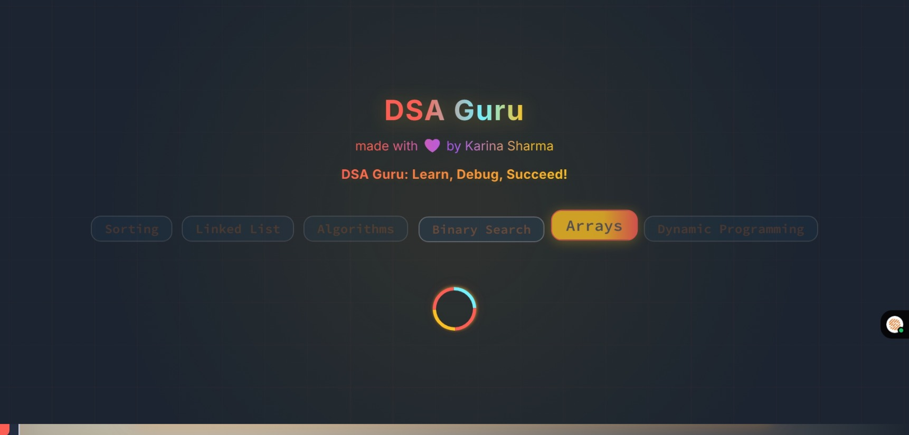
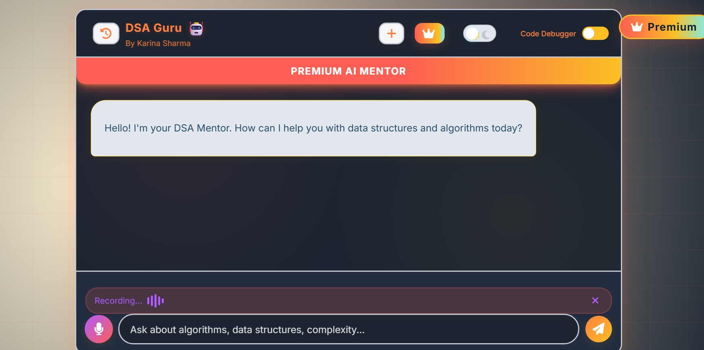
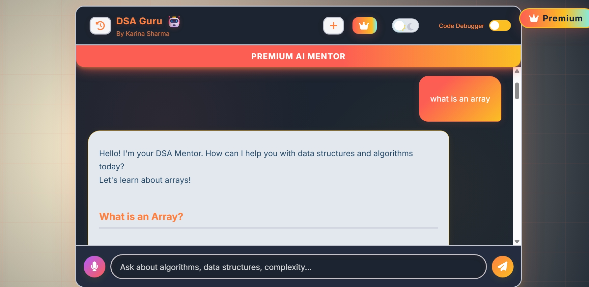
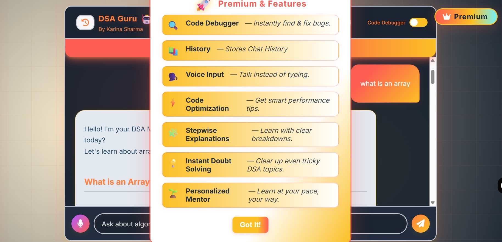
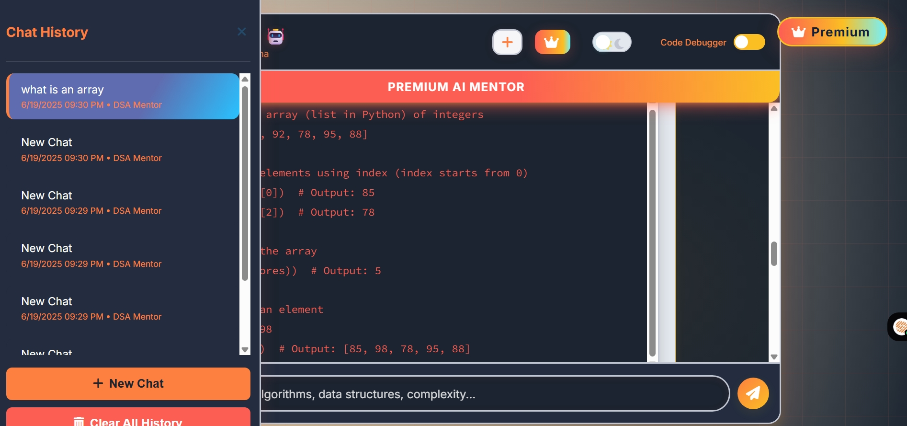
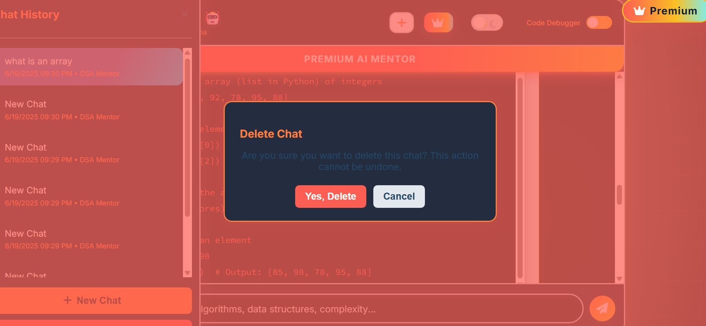

# DSA_Guru

DSA Guru is a web-based application designed to help users learn, practice, and master Data Structures and Algorithms (DSA). It provides interactive tools, explanations, and code examples to make concepts easy to understand and apply.

## 🚀 Features

- 📚 **Theory & Explanations:** Clear explanations of common data structures and algorithms.
- 🛠️ **Interactive Practice:** Hands-on coding challenges to test and improve your skills.
- 👨‍💻 **Live Code Execution:** Run and test code snippets directly in the browser.
- 💡 **Tips & Tricks:** Pro tips for interviews and competitive programming.
- 🤝 **User-Friendly Interface:** Simple, clean, and responsive design for seamless learning.
- 🗣 Voice Messaging for hands-free learning
- 📚 Chat History
- ✨ Animated Preloader to set the learning vibe
- 🧹 Easy history clearing with one click
- 🛠 One-click Code Debugger

## 🌐 Demo

Check out the live demo: [DSA Guru Live] (https://dsa-guru12.netlify.app/)

## 🖼️ Screenshots

## 🛠️ Technologies Used

- HTML, CSS, JavaScript
- [Google Gemini API]
- [Netlify](https://www.netlify.com/) *(for deployment)*

## 📄 License

This project is licensed under the [MIT License](LICENSE).

## 🙌 Acknowledgements

- [Google Gemini](https://ai.google.dev/)
- [Netlify](https://www.netlify.com/)
- [LeetCode](https://leetcode.com/), [GeeksforGeeks](https://www.geeksforgeeks.org/) *(for DSA practice inspiration)*

---

> **Made with ❤️ by Karina Sharma**
